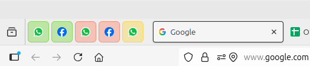

# Firefox Container Tabs Full Color Theme

Customization for Firefox 128+ (tested up to 142).

This `userChrome.css` colors the entire tab with the container color and removes the top bar.

---

## 🚀 Prerequisites

- Firefox browser (version 128 or higher)
- [Multi-Account Containers](https://addons.mozilla.org/en-US/firefox/addon/multi-account-containers/) extension installed
- Containers configured and pinned for automatic startup (see setup instructions below)

---

## 📋 Installation

1. In Firefox, type `about:config` and enable:
   ```
   toolkit.legacyUserProfileCustomizations.stylesheets = true
   ```
2. Type `about:support` and click **Open Profile Folder**.
3. Create a folder called `chrome`.
4. Place the `userChrome.css` file inside it.
5. Restart Firefox.

---

## ⚙️ Container Setup

To have your containers automatically open on Firefox startup:

1. Open each container tab you want to persist
2. Right-click on the tab and select **Pin Tab**
3. These pinned container tabs will now automatically open when you start Firefox

---

## 🎨 Preview



The preview shows pinned container tabs that automatically open with Firefox, each fully colored according to its container theme.

---

## 📜 Licença
Este projeto está sob a licença MIT - veja o arquivo [LICENSE](LICENSE) para mais detalhes.
